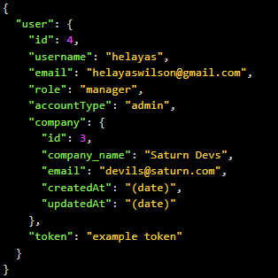
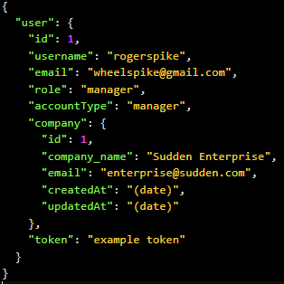
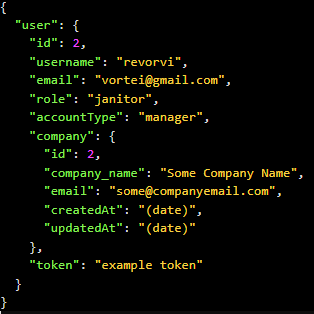
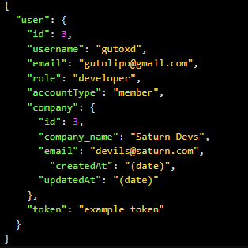
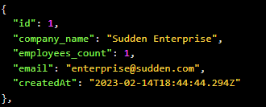
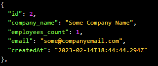
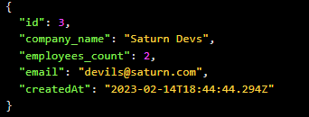

# Punch Clock 👊

"Punch Clock" is intended to enable the registration of the punch in and punch out of a company. With users and companies managed be a predetermined user account, the creation of different accounts with different access types, "Punch Clock" lends itself to doing the essencial of register data and calculating the difference of "IN" and "OUT". 

## Technologies 

The project was made with [Typescript](https://www.typescriptlang.org) inside the framework [NestJS](https://nestjs.com) with specific folders for each part of project. The mapping of relations and requisitions to database was managed using [TypeORM](https://typeorm.io) and the said database was registered in [PostgreSQL](https://www.postgresql.org). For reasons of organization and aesthetics [Eslint](https://eslint.org) and [Prettier](https://prettier.io).

## Routes 

Beside the Creation route of punches, it also has the account creation route, user information update, account login and another one to certify that you are logged in to a user account. For companies it has similar routes, Create, Deactive/Reactive, Show Single Company and Show Activated Companies. Finally, the punch routes are for creating and listing the punches based on user.

The routes can be better seen in [Insomnia](https://insomnia.rest), the routes file are [here](insomnia/PUNCH-CLOCK-ROUTES.json)

## How to start?

At first, to initialize the project you can use teminal command ```yarn start``` by default, however it does not prevent you from being able to use ```npm``` as well if configured.

The project relies on using migrations and to configure right is required to change [.env_example]() name to ".env" only and alter the informations inside to yours, then use terminal command ```yarn db:migrate``` to load all the migrations of create and alter tables in database, after that, use ```yarn db:seed``` to populate database with some datas preseteds, so it is possible to check some of funcionalities without send every single data by hands.

## Some technical details

To register new companies and users, the account type have to be "admin", if not you can't be able to access this routes. (After login, copy and place the token as a Bearer Token at another routes) So to make this possible, in the seeds, one of the account registered is an admin type as seen below.



Now these are more users that can be accessed with login (Further on you will see how to send a requisition and how the reponse will look like).

  

Then comes all companies registered with the seed.

  

### How to send requisition?

#### User routes

> Login User

The correct way to send a requisition to **Login User** for example, is pass an object called user with fields username and password as the image below.


At this point what I can tell you is that almost every requisition is to send an user object, what it change is the fields.

> Create User

To create it is necessary to send at least this fields (remembering that to have successful access to this route you will have to pass the correct bearer token of an "admin" account).

# 🚧 IN PROCESS TO BUILDING... 🚧
